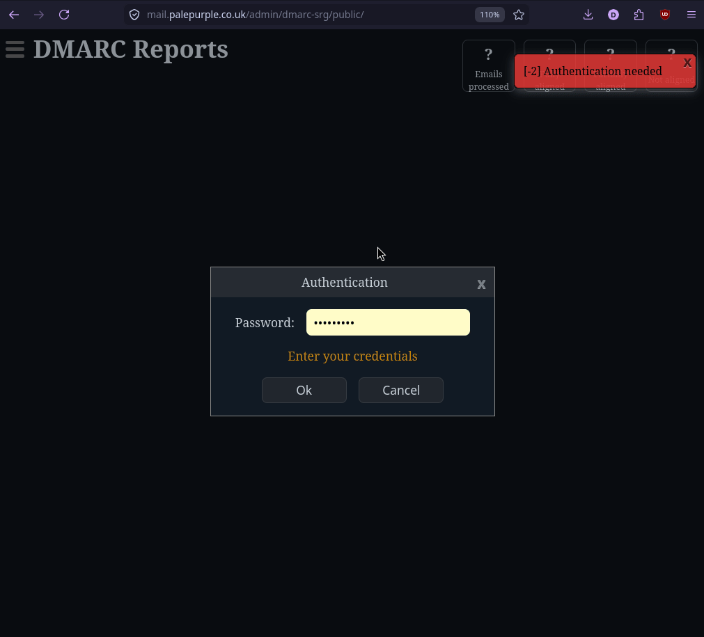
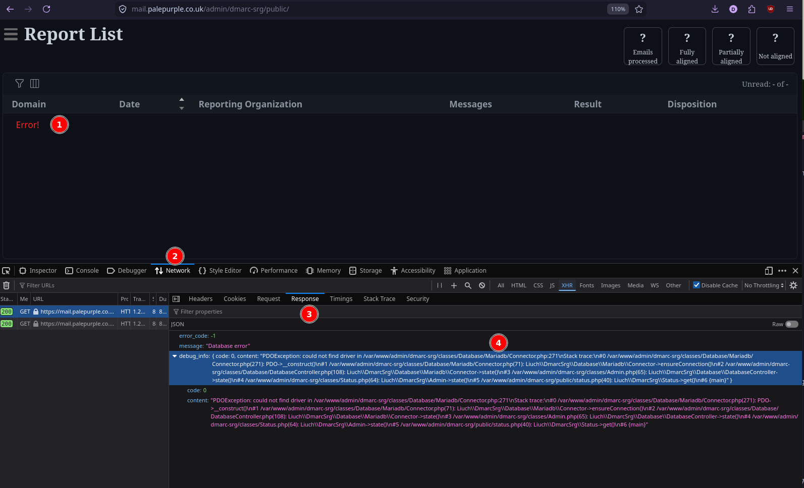

# Install code

This was written assuming a Debian like system, using Apache. The web server was already configured to run PHP 8.2.

It's left as an exercise to the end user to decide where exactly they wish to install this. `/var/www/html/` probably won't work for everyone.

```shell
cd /var/www/html
```

## Downloading dmarc-srg
Either :
```shell
git clone git@github.com:liuch/dmarc-srg.git
cd dmarc-srg
```

OR ... download a release from : https://github.com/liuch/dmarc-srg/releases, e.g.

```shell
wget -O dmarc.tgz https://github.com/liuch/dmarc-srg/archive/refs/tags/v3.0-pre2.tar.gz
tar -zvxf dmarc.tgz
cd dmarc-srg-3.0-pre2
```

## Installing libraries etc

Using 'composer'

```shell
curl -o composer https://getcomposer.org/download/2.9.5/composer.phar
php composer selfupdate
php composer install -n
```

At this point, *composer* should warn if you are missing any required extensions (like PDO or XML support). You may have to do something like :

```shell
apt install php8.2-xml php8.2-mysql php8.2-dom
service apache2 restart
```

# Configure the webserver (Apache)

A simple configuration for a webserver is below, it just needs to have the dmarc-srg/**public** folder as the DocumentRoot.

If you're using Apache, an appropriate VirtualHost configuration in /etc/apache2/sites-available/dmarc.conf might look like :

You may also wish to apply other security restrictions on the above - e.g. to only allow access from specific IP addresses.

```apacheconf
<VirtualHost *:80>
    ServerName dmarc.example.com
    DocumentRoot /var/www/html/dmarc-srg/public
    <Directory /var/www/html/dmarc-srg/public>
        AllowOverride All
        Require all granted
    </Directory>
</VirtualHost>
```

then perhaps :

```shell
apache2ctl configtest
a2ensite dmarc
service apache2 restart
```

# Create MySQL/MariaDB database

Connect to your MySQL compatible database and run the below as the MySQL 'root' (or similar) user.  You need to access to create a database and user account.

Change the database or user name to to suit your requirements.

```SQL
CREATE DATABASE dmarc;
GRANT ALL ON dmarc.* TO dmarc_user@localhost identified by 'SomeComplexPasswordHere';
FLUSH PRIVILEGES;
```

# dmarc-srg configuration - config/conf.php

```shell
cd config
cp config.sample.php config.php
```

Edit the config.php file.

 * Add database connection details.
 * Configure an 'admin' password (needed for the web ui)

# Check we're ready to go

```shell
php -f utils/check_config.php
```

which might output something like :

```txt
=== GENERAL INFORMATION ===
  * OS information: Linux 6.12.77 #1 SMP PREEMPT_DYNAMIC Mon Mar 23 19:24:03 UTC 2026 x86_64
  * PHP version:    8.2.30

=== EXTENSIONS ===
  * pdo_mysql...................... Ok
  * xmlreader...................... Ok
  * zip............................ Ok
  * json........................... Ok

....

=== MAILBOXES ===
  * Checking mailboxes config...... Ok
    Message: 1 mailbox found
  * Imap library................... Fail
    Message: Neither ImapEngine nor PHP IMAP extension is installed

=== DIRECTORIES ===
  * Checking directories config.... Ok
    Message: No directories found

=== REMOTE FILESYSTEMS ===
  * Getting configuration.......... Skipped
    Message: Configuration not found

=== REPORT MAILER ===
  * Getting configuration.......... Ok
  * Checking mailer/method......... Ok
  * Checking mailer/library........ Ok
  * Checking mailer/default........ Ok
  * Checking mailer/from........... Ok

===
There are 1 error and 2 warnings!

```

Fix the above issues as appropriate e.g. to fix the IMAP related warning you could :

 * install the 'php-imap' package `apt install php-imap`
 * or run `php composer require directorytree/imapengine`


# Initialise MySQL database

Run this :

```shell
php -f utils/database_admin.php init
```

# Browse to the web ui

https://dmarc.example.com

Login with the admin password you defined in conf/conf.php.

Once there, add your domain - menu -> settings -> domains -> "New domain"



Alternatively you can do it on the command line using :
```shell
php -f utils/domains_admin.php add_domain name=example.com active=1
```

# Enable DMARC reports for your domain(s)

Your domain's _dmarc.example.com TXT record should look something like :

```txt
v=DMARC1; p=reject; rua=mailto:dmarc-rua@example.com
```

Where dmarc-rua@example.com is an IMAP mailbox you've already created, and configured as a mailbox within dmarc-srg in `config/conf.php`

If the domain the notification(s) are going to does NOT match the domain the DMARC record is for, you'll need to read https://dmarc.org/2015/08/receiving-dmarc-reports-outside-your-domain/


# Enable automated collection of dmarc reports from your imap folder

This will retrieve reports from the imap folder every hour.

```shell
cat <<EOF > /etc/cron.hourly/dmarc-fetch
#!/bin/sh
cd /path/to/dmarc-srg
php -f utils/fetch_reports.php
EOF

chmod 750 /etc/cron.hourly/dmarc-fetch
```


# Enable automated summary report

For example, adding a /etc/cron.daily job like the below to trigger a daily report covering the last week


```shell
cat <<EOF > /etc/cron.daily/dmarc-srg-summary
#!/bin/sh
cd /path/to/dmarc-srg
php -f utils/summary_report.php domain=all period=lastweek
EOF

chmod 750 /etc/cron.daily/dmarc-srg-summary
```

(run: `php -f utils/summary_report.php` for a full list of options and how to override the configuration to send a report to someone else for specific domains)

# Tips if things don't behave ...

Try editing `config/conf.php` and set `$debug = 1;` near the top.

Then inspecting traffic to the server with your web browser - e.g. in Firefox you might see something like this :



(In this specific instance, Apache hadn't been restarted since the PHP PDO + MySQL extension was installed).


